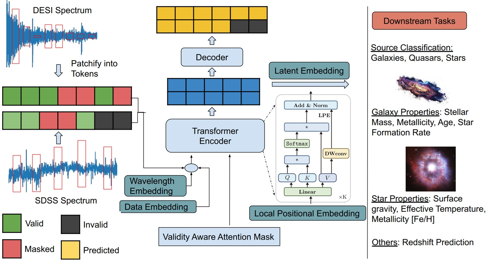

# Cosmic-AI

AI enhanced solutions for cosmology and astronomy. Following are the current research projects:

## [CAI - Scalable Foundation Model Inference on Cloud](https://arxiv.org/pdf/2501.06249?)

A novel **Cloud-based Astronomy Inference (CAI)** framework for data parallel AI model inference on AWS. We can classify 500K astronomy images using the AstroMAE model in a minute !

### Fig: CAI framework design on AWS State Machine.

## OmniSpectra: A Unified Foundation Model for Native Resolution Astronomical Spectra

The first foundation model to process variable lengths of spectra from arbitrary instruments at their original size/resolution, without resizing or downsampling to a fixed size. 

### Fig: OmniSpectra Model Architecture.

## IC-pixel Diffusion

Pixel-based diffusion model for reconstructing cosmological initial conditions from observable data.

## Acknowledements

This work is supported by **NSF-Simons AI Institute for Cosmic Origins**. For more details please visit [cosmicai.org](https://cosmicai.org/) and [NSF News article](https://www.nsf.gov/news/nsf-simons-foundation-launch-2-ai-institutes-help).

